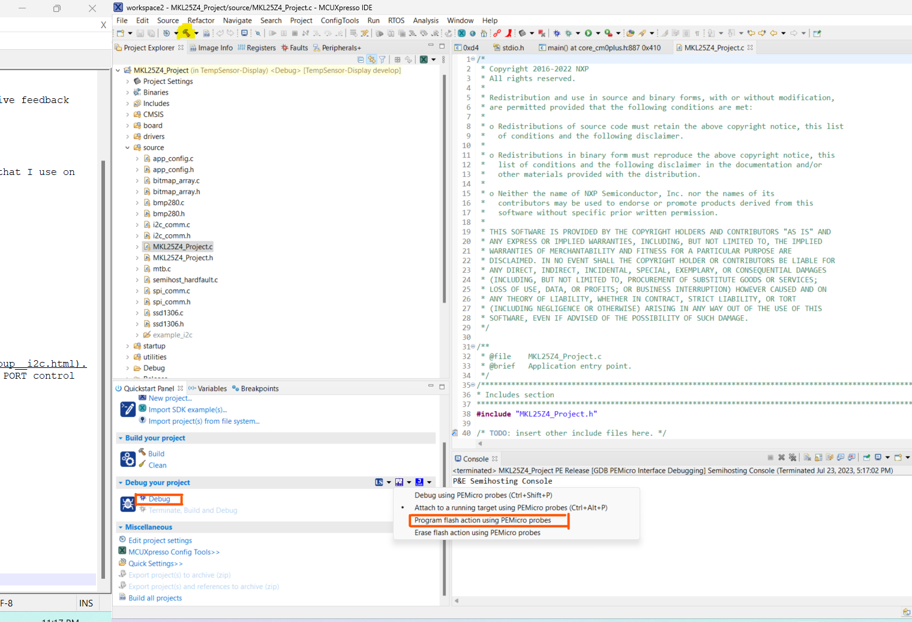

# BMP280 Temperature Sensor Integrated to SSD1306 OLED screen using FRDM-KL25

## Overview
This is a simple baremetal project where an MCU (FRDM-KL25 dev board) is used to communicate to a temperature sensor (BMP280) and then displays this data to an OLED display. Communication is done via I2C and power supply given from a PC.
This was purely a hobbyist project. I had undertaken this for the below reasons:
- simply to learn I2C communication between peripherals.
- develop the skill to read (swim) through a datasheet and seek out for the necessary info.
- understand how to use better the FRDM-KL25 MCU.

That being said, the API's that I had made over NXP's communication might be of some use to the community, hence I am pushing this project here. I'm happy also to receive feedback on the same. The code is pretty rustic, but I've tried to make the API's as modular/abstract as possible.

Development IDE : MCUXpresso
Programming Language : C

Also credits to [Eran Duchan](http://www.eran.io/the-dot-factory-an-lcd-font-and-image-generator/) for his awesome code generator to output the bitmaps of Calibri 7pt that I use on my display.

## Getting Started

### Schematic

The actual prototype with the dev board would look something like this                                           

### Program Structure
1. All the files meant for build are in the "source" directory.
2. Each of the sensors have their own files and access the i2c using the APIs in the i2c_comm.c folder.
3. bitmap_array.c is a Middlware file that is a library of all the characters that can be drawn on the OLED display in bitmapped format.
4. The main program runs in the MKL25Z4_Project.c file.

### Documentation Links
Below are the sources that helped me through this project

1. [FRDM-KL25 User Manual](https://www.mouser.com/pdfdocs/FRDM-KL25Z.pdf)
2. [FRDM-KL25's Pinouts](https://www.openhacks.com/uploadsproductos/frdm-kl25z_pinouts__rev_1.0_.pdf)
3. Have a look through NXP's APIs online that could be used to configure GPIO's, set up I2C, etc, like [this for example](https://mcuxpresso.nxp.com/api_doc/dev/116/group__i2c.html).
4. Or manually configure them by referring to the Reference Manual [here](https://spivey.oriel.ox.ac.uk/dswiki/images-digisys/5/56/KL25-refman.pdf). Chapters 11,12 (on PORT control and Clock Gating), 38 (on I2C) and and 41 (on GPIOs) would be of interest.
5. Have a read through [SSD1306's Datasheet](https://cdn-shop.adafruit.com/datasheets/SSD1306.pdf).
6. Finally, BMP280's datasheet [here](https://cdn-shop.adafruit.com/datasheets/BST-BMP280-DS001-11.pdf).

## Usage

### Importing Project
1. Make sure MCUXpresso is downloaded and open a workspace
2. Download this git repo and then go to File->Open Projects From File System

3. Go to the path directory and select this folder(shown in below pic) and click Finish

4. The project should be opened as shown below. 

### Build and Flash
1. Using the hammer button, you can build to generate the .bin and .axf files for flash and debug.
2. Power up the FRDM-KL25Z on the SDA USB port (the port on the right if the ports face down).
3. Next, to flash either flash directly as shown in the pic below and selecting "Program Flash Action Using PEMicro probes"
4. Or just click on the Blue beetle that says "Debug", which flashes and enters into Debug mode via openSDA.

### Working Prototype
1. After flashing you should see the temperature getting updated at an interval of every 1s.                                    
